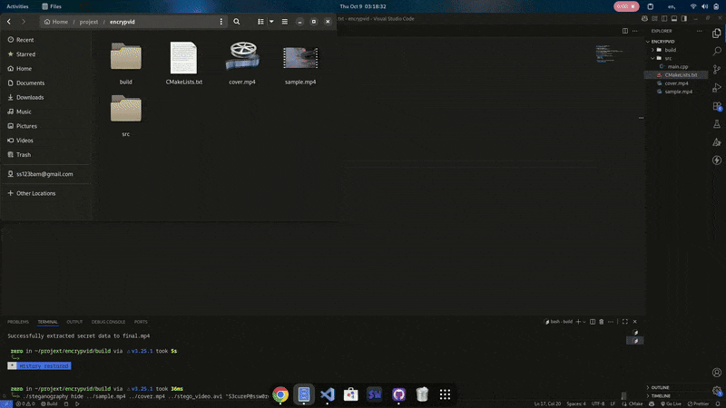

# 🛡️ SecureStego: AES-256 Encrypted Video & Image Steganography

[](https://opensource.org/licenses/MIT)
[](https://github.com/)
[](https://isocpp.org/)

SecureStego is a powerful C++ command-line tool that allows you to encrypt any file (text, images, videos, etc.) with **AES-256** and then hide it securely within the pixels of a cover image or the frames of a cover video using **Least Significant Bit (LSB) steganography**.

This project provides a dual-layer security solution: your data is not only cryptographically secure but also concealed from casual observation.

## Key Features

* **Strong Encryption:** Secures your secret file with the industry-standard **AES-256** algorithm before hiding it.
* **High-Capacity Carrier:** Supports both static **images (PNG)** and **videos (AVI)** as cover media.
* **Flexible Payload:** Hide any file type as your secret payload.
* **Imperceptible:** The LSB embedding technique ensures that the changes to the cover media are visually undetectable.
* **Cross-Platform:** Built with CMake to be easily compilable on Windows, macOS, and Linux.

## How It Works

The tool follows a simple but robust three-step process for hiding data:

1.  **Encrypt:** The secret file is read as a binary stream and encrypted with AES-256 using a key derived from your password.
2.  **Embed:** The encrypted data (along with a size header and an IV) is converted into a bitstream. These bits are then embedded one by one into the least significant bits of the pixel color data of the cover media.
3.  **Package:** The modified frames or pixels are saved into a new file. For videos, a **lossless codec (FFV1)** is used to ensure the hidden data is perfectly preserved.

[Image of the LSB steganography process]

The extraction process is the exact reverse of these steps.
## Demo


## Prerequisites

Before you can build the project, you need to have the following dependencies installed on your system:

* A **C++17** compatible compiler (GCC, Clang, or MSVC)
* **CMake** (version 3.10 or higher)
* **OpenCV** (version 4.x)
* **OpenSSL** (version 1.1.1 or higher)

#### Installation on Linux (Ubuntu/Debian)
```bash
sudo apt update
sudo apt install build-essential cmake libopencv-dev libssl-dev
```
#### Installation on macOS (using Homebrew)
```bash
brew install cmake opencv openssl
```
## Build Instructions
You can build the project easily using CMake:
```bash
# 1. Clone the repository
git clone https://github.com/sa778888/SecureStego
cd SecureStego

# 2. Create a build directory
mkdir build
cd build

# 3. Configure the project with CMake
cmake ..

# 4. Compile the code
make
```
An executable named steganography (or steganography.exe on Windows) will be created inside the build directory.

## Usage
Run the executable from within the build directory.

Image Steganography
Important: Always use a lossless image format like PNG or BMP. Using JPEG will corrupt the hidden data.

To Hide a File in an Image:
```bash
./steganography hide <cover_image.png> <secret_file> <output_image.png> "<password>"
```
Example:

```bash

./steganography hide ../media/cover.png ../media/secret.txt ../stego_image.png "mySuperSecretPassword123"
```
To Extract a File from an Image:

```Bash

./steganography extract <stego_image.png> <output_file> "<password>"
```
Example:

```Bash

./steganography extract ../stego_image.png ../retrieved_secret.txt "mySuperSecretPassword1
```
## Video Steganography
Critical: The output video must have an .avi extension to use the required lossless codec. The input cover video can be a standard format like .mp4.

To Hide a File in a Video:
```bash

./steganography hide <cover_video.mp4> <secret_file> <output_video.avi> "<password>"
```
Example:

```Bash

./steganography hide ../media/cover.mp4 ../media/secret_video.mp4 ../stego_video.avi "another-strong-password"
```
To Extract a File from a Video:
```Bash

./steganography extract <stego_video.avi> <output_file> "<password>"
```
Example:

```Bash

./steganography extract ../stego_video.avi ../retrieved_video.mp4 "another-strong-password"
```
## Important Notes
File Formats: Using the correct file formats is essential. Use PNG for images and ensure your output video is AVI.

Capacity: The cover media must be significantly larger than the secret file. As a rule of thumb, the cover file needs to have at least 8 times the storage capacity of the secret payload.

Passwords: There is no "wrong password" error. If you use the wrong password during extraction, the output file will be generated but will be corrupted and unusable.

## License
This project is licensed under the MIT License. See the [LICENSE](LICENSE) file for details.

